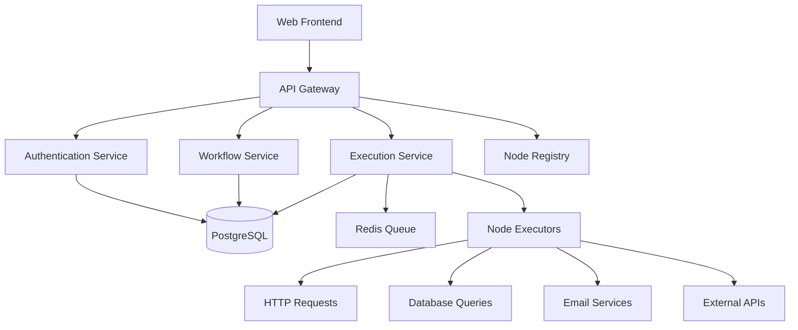

# 📚 n8n Clone Documentation

Welcome to the comprehensive documentation for your ultra-scalable n8n-like workflow automation platform! This documentation provides everything you need to understand, develop, deploy, and maintain your workflow automation system.

## 📖 Documentation Overview

### 🚀 Getting Started
- **[Installation & Setup](./installation-setup.md)** - Complete setup guide for development and production
- **[Quick Start Guide](./quick-start.md)** - Get up and running in 5 minutes
- **[Architecture Overview](./architecture-overview.md)** - High-level system architecture

### 🔧 Development
- **[API Documentation](./api-documentation.md)** - Complete REST API reference
- **[Node System](./node-system.md)** - How to create and manage workflow nodes
- **[Workflow Engine](./workflow-engine.md)** - Core execution engine documentation
- **[Database Schema](./database-schema.md)** - Complete database structure
- **[Authentication](./authentication.md)** - User management and security

### 🧪 Testing & Quality
- **[Testing Guide](./testing-guide.md)** - Comprehensive testing documentation
- **[Code Quality](./code-quality.md)** - Standards and best practices

### 🚀 Deployment & Operations
- **[Deployment Guide](./deployment-guide.md)** - Production deployment strategies
- **[Monitoring](./monitoring.md)** - System monitoring and alerting
- **[Performance](./performance.md)** - Optimization and scaling

### 🤝 Contributing
- **[Contributing Guide](./contributing.md)** - How to contribute to the project
- **[Development Workflow](./development-workflow.md)** - Git workflow and processes

### 🔧 Troubleshooting
- **[Troubleshooting](./troubleshooting.md)** - Common issues and solutions
- **[FAQ](./faq.md)** - Frequently asked questions

## 🎯 Key Features Documented

### ✅ Core Functionality
- **Multi-tenant Architecture** - Organizations, teams, and user management
- **Workflow Canvas** - Drag-and-drop workflow designer
- **Node System** - Extensible plugin architecture for automation nodes
- **Execution Engine** - High-performance workflow execution
- **Real-time Monitoring** - Live execution tracking and metrics

### ✅ Enterprise Features
- **Role-based Access Control** - Granular permissions system
- **Credential Management** - Secure API key and credential storage
- **Audit Logging** - Complete execution and user activity tracking
- **API-first Design** - RESTful APIs for all functionality
- **Scalable Architecture** - Horizontal scaling capabilities

### ✅ Developer Experience
- **Comprehensive Testing** - 90%+ test coverage
- **API Documentation** - Auto-generated OpenAPI specs
- **Development Tools** - Docker, CI/CD, monitoring
- **Code Quality** - PHPStan, Pint, automated testing

## 🏗️ Architecture Highlights



## 📊 System Statistics

- **Languages**: PHP 8.3+, JavaScript (Node.js for execution)
- **Framework**: Laravel 12 with custom workflow engine
- **Database**: PostgreSQL with Redis for caching/queues
- **Testing**: PHPUnit + Pest with 90%+ coverage
- **API**: RESTful with OpenAPI 3.0 documentation
- **Authentication**: Laravel Sanctum with RBAC

## 🚀 Quick Start

```bash
# Clone and setup
git clone <your-repo>
cd n8n-ai-lara
composer install
npm install

# Setup environment
cp .env.example .env
php artisan key:generate

# Database setup
php artisan migrate
php artisan n8n:seed-demo --fresh

# Start development server
php artisan serve
npm run dev
```

## 📚 Documentation Standards

This documentation follows these standards:

- **🔍 Comprehensive** - Every feature and API endpoint documented
- **📖 Practical** - Real examples and code samples
- **🔄 Up-to-date** - Maintained with code changes
- **🎯 Accessible** - Clear navigation and search functionality
- **📱 Responsive** - Works on all devices

## 🤝 Contributing to Documentation

We welcome contributions to our documentation! Please:

1. Follow the established structure and format
2. Include practical examples and code samples
3. Test all code examples
4. Update related documentation when making changes
5. Use clear, concise language

## 📞 Support

- **📧 Email**: support@n8n-clone.com
- **💬 Discord**: [Join our community](https://discord.gg/n8n-clone)
- **🐛 Issues**: [GitHub Issues](https://github.com/your-repo/issues)
- **📖 Docs**: [Documentation Site](https://docs.n8n-clone.com)

---

**🎉 Happy automating with your n8n clone!**

*Built with ❤️ for workflow automation enthusiasts*
