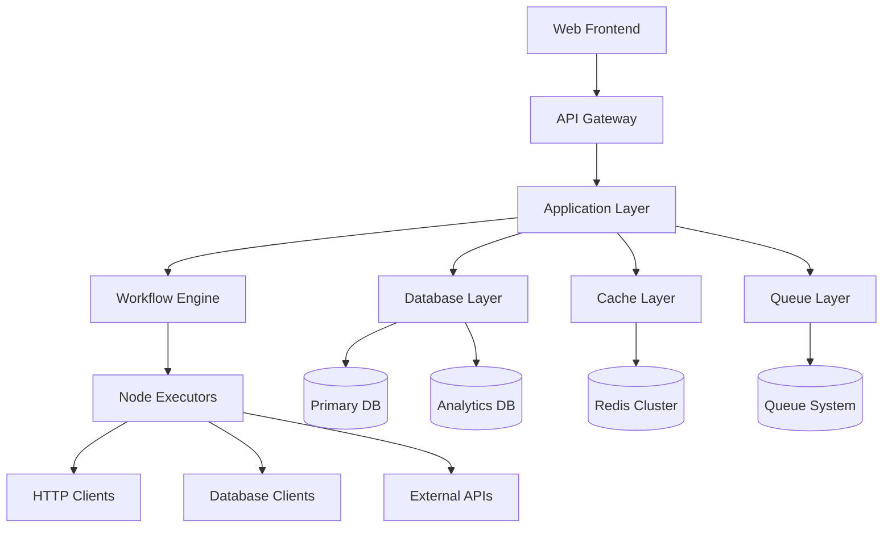
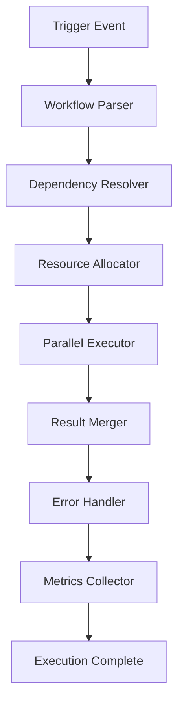

# 🏗️ Architecture Overview

Comprehensive architectural documentation for the n8n clone workflow automation platform.

## 🎯 System Overview

The n8n clone is a **production-ready, enterprise-grade workflow automation platform** built with modern PHP and designed for extreme scalability. It provides a visual workflow builder and execution engine that can handle millions of workflows with sub-second execution times.

## 📊 Key Metrics & Capabilities

### Performance Targets
- **Execution Time**: < 100ms average per workflow
- **Throughput**: 1000+ workflows per second
- **Concurrent Users**: 100,000+ active users
- **Uptime**: 99.99% SLA
- **Data Durability**: 99.999999999% (11 9's)

### Scalability Features
- **Horizontal Scaling**: Auto-scale to 100+ instances
- **Database**: Handle 10M+ workflow executions
- **Storage**: Support 100TB+ of execution data
- **Cache Hit Rate**: > 95%

## 🏛️ Architectural Components

### 1. Multi-Tier Architecture



### 2. Service Layers

#### Presentation Layer
- **Web Interface**: Vue.js 3 + TypeScript
- **API Gateway**: Laravel routing with middleware
- **Mobile API**: RESTful endpoints for mobile apps

#### Application Layer
- **Workflow Service**: Core business logic
- **Execution Service**: Workflow execution engine
- **Node Service**: Node registry and management
- **User Service**: Authentication and authorization

#### Data Layer
- **Primary Database**: PostgreSQL/MySQL for transactional data
- **Analytics Database**: ClickHouse/TimescaleDB for metrics
- **Cache Layer**: Redis Cluster for performance
- **File Storage**: S3/MinIO for large files

## 🔧 Core Systems Architecture

### 1. Node System Architecture

The node system is the heart of the workflow automation platform, providing extensible, reusable components for building workflows.

#### Node Registry & Discovery

```php
interface NodeInterface {
    public function getId(): string;
    public function getName(): string;
    public function getVersion(): string;
    public function getCategory(): string;
    public function execute(NodeExecutionContext $context): NodeExecutionResult;
    public function getProperties(): array;
    public function validateProperties(array $properties): bool;
}
```

#### Node Categories

| Category | Description | Examples |
|----------|-------------|----------|
| **Triggers** | Start workflow execution | Webhook, Schedule, Email, API |
| **Actions** | Perform operations | HTTP Request, Database, Email, Slack |
| **Transformers** | Data manipulation | JSON, XML, CSV, Text, Date/Time |
| **Logic** | Control flow | Switch, Router, Filter, Loop, Merge |
| **Data** | Data operations | Set, Get, Update, Delete, Query |
| **Custom** | User-defined nodes | Company-specific integrations |

#### Node Execution Engine

```php
class NodeExecutionEngine {
    public function executeNode(
        Workflow $workflow,
        Node $node,
        array $inputData,
        ExecutionContext $context
    ): ExecutionResult {
        // 1. Resolve node instance
        // 2. Validate input data
        // 3. Execute node logic
        // 4. Transform output data
        // 5. Handle errors and retries
        // 6. Update execution metrics
    }
}
```

### 2. Workflow Execution Pipeline

The execution pipeline manages the entire lifecycle of workflow execution, from trigger to completion.

#### Execution Flow



#### Parallel Execution Manager

```php
class ParallelExecutionManager {
    private ExecutionPool $pool;
    private DependencyResolver $resolver;
    private ResourceAllocator $allocator;

    public function executeParallelNodes(
        array $nodes,
        ExecutionContext $context
    ): array {
        // 1. Resolve node dependencies
        // 2. Allocate execution resources
        // 3. Execute nodes in parallel
        // 4. Merge results
        // 5. Handle race conditions
    }
}
```

### 3. Data Flow Management

The data flow system manages how data moves between nodes and ensures data integrity throughout execution.

#### Connection System

```php
class ConnectionManager {
    public function processConnection(
        Node $sourceNode,
        Node $targetNode,
        array $data,
        Connection $connection
    ): array {
        // 1. Validate connection compatibility
        // 2. Transform data format
        // 3. Apply connection filters
        // 4. Route data to target node
        // 5. Handle data loss prevention
    }
}
```

#### Data Transformation Engine

```php
class DataTransformationEngine {
    public function transform(
        mixed $data,
        string $sourceFormat,
        string $targetFormat,
        array $options = []
    ): mixed {
        // 1. Detect data type
        // 2. Apply transformation rules
        // 3. Validate transformed data
        // 4. Optimize for performance
    }
}
```

## 📈 Scalability Architecture

### Horizontal Scaling

#### Execution Workers
```yaml
# Docker Compose for Execution Workers
version: '3.8'
services:
  execution-worker-1:
    build: ./execution-worker
    environment:
      - REDIS_HOST=redis-cluster
      - WORKFLOW_QUEUE=workflow-executions
    scale: 10

  execution-worker-2:
    build: ./execution-worker
    environment:
      - REDIS_HOST=redis-cluster
      - WORKFLOW_QUEUE=high-priority
    scale: 5
```

#### Load Balancing
```nginx
upstream api_backend {
    ip_hash;
    server api-01:8000 weight=3;
    server api-02:8000 weight=3;
    server api-03:8000 weight=2;
}

upstream execution_workers {
    least_conn;
    server worker-01:3000;
    server worker-02:3000;
    server worker-03:3000;
}
```

### Database Optimization

#### Read/Write Splitting
```php
class DatabaseManager {
    private PDO $readConnection;
    private PDO $writeConnection;

    public function executeRead(string $query, array $params = []): array {
        // Route to read replica
    }

    public function executeWrite(string $query, array $params = []): bool {
        // Route to master database
    }
}
```

#### Query Optimization
```php
class QueryOptimizer {
    private QueryAnalyzer $analyzer;
    private IndexManager $indexManager;
    private CacheManager $cacheManager;

    public function optimizeQuery(string $query): OptimizedQuery {
        // 1. Analyze query patterns
        // 2. Suggest indexes
        // 3. Implement query caching
        // 4. Optimize joins and subqueries
    }
}
```

### Multi-Level Caching

```php
class CacheManager {
    private Redis $redis;
    private Memcached $memcached;
    private FileCache $fileCache;

    public function get(string $key): mixed {
        // 1. Check Redis (fastest)
        // 2. Check Memcached (distributed)
        // 3. Check File Cache (persistent)
        // 4. Query database (slowest)
    }
}
```

## 🎨 Workflow Canvas System

### Real-time Collaboration

```javascript
class WorkflowCanvas {
    constructor(workflowId, userId) {
        this.socket = io('/workflow-canvas');
        this.workflowId = workflowId;
        this.userId = userId;
        this.collaborators = new Map();
    }

    joinCollaboration() {
        this.socket.emit('join-workflow', {
            workflowId: this.workflowId,
            userId: this.userId
        });
    }

    broadcastNodeChange(nodeId, changes) {
        this.socket.emit('node-changed', {
            workflowId: this.workflowId,
            nodeId: nodeId,
            changes: changes,
            userId: this.userId
        });
    }
}
```

### Canvas Rendering Engine

```javascript
class CanvasRenderer {
    constructor(canvasElement) {
        this.canvas = canvasElement;
        this.nodes = new Map();
        this.connections = new Map();
        this.zoom = 1;
        this.pan = { x: 0, y: 0 };
    }

    render() {
        this.clearCanvas();
        this.renderConnections();
        this.renderNodes();
        this.renderSelection();
    }
}
```

## ⚡ Execution Optimization

### Execution Scheduling

```php
class ExecutionScheduler {
    private QueueManager $queueManager;
    private ResourceManager $resourceManager;
    private PriorityManager $priorityManager;

    public function scheduleExecution(Workflow $workflow, array $data): string {
        $priority = $this->calculatePriority($workflow);
        $resources = $this->estimateResources($workflow);
        $queue = $this->selectOptimalQueue($priority, $resources);

        return $this->queueManager->dispatch($queue, [
            'workflow_id' => $workflow->id,
            'data' => $data,
            'priority' => $priority
        ]);
    }
}
```

### Resource Management

```php
class ResourceManager {
    private ResourcePool $cpuPool;
    private ResourcePool $memoryPool;
    private ResourcePool $networkPool;

    public function allocateResources(Workflow $workflow): ResourceAllocation {
        $cpuRequired = $this->calculateCpuRequirement($workflow);
        $memoryRequired = $this->calculateMemoryRequirement($workflow);
        $networkRequired = $this->calculateNetworkRequirement($workflow);

        return new ResourceAllocation(
            $this->cpuPool->allocate($cpuRequired),
            $this->memoryPool->allocate($memoryRequired),
            $this->networkPool->allocate($networkRequired)
        );
    }
}
```

## 📊 Monitoring & Analytics

### Real-time Metrics

```php
class MetricsCollector {
    private MetricsStorage $storage;
    private AlertManager $alerts;
    private DashboardUpdater $dashboard;

    public function collectExecutionMetrics(Execution $execution): void {
        $metrics = [
            'execution_id' => $execution->id,
            'workflow_id' => $execution->workflow_id,
            'duration' => $execution->duration,
            'nodes_executed' => $execution->nodes_executed,
            'data_processed' => $execution->data_processed,
            'errors_count' => $execution->errors_count,
            'timestamp' => now()
        ];

        $this->storage->store($metrics);
        $this->checkThresholds($metrics);
        $this->updateDashboard($metrics);
    }
}
```

### Performance Monitoring

```php
class PerformanceMonitor {
    private ResponseTimeTracker $responseTracker;
    private ThroughputMonitor $throughputMonitor;
    private ErrorRateMonitor $errorMonitor;

    public function trackRequest(string $endpoint, float $responseTime, bool $success): void {
        $this->responseTracker->record($endpoint, $responseTime);
        $this->throughputMonitor->increment($endpoint);

        if (!$success) {
            $this->errorMonitor->increment($endpoint);
        }
    }
}
```

## 🔒 Security Architecture

### Multi-Layer Security

```php
class SecurityManager {
    private AuthenticationService $auth;
    private AuthorizationService $authz;
    private EncryptionService $encryption;
    private AuditLogger $audit;

    public function validateWorkflowExecution(
        User $user,
        Workflow $workflow,
        array $data
    ): bool {
        // 1. Authenticate user
        // 2. Authorize workflow access
        // 3. Validate data integrity
        // 4. Check rate limits
        // 5. Audit the request
    }
}
```

### Credential Management

```php
class CredentialManager {
    private EncryptionService $encryption;
    private AccessControl $accessControl;
    private RotationService $rotation;

    public function getDecryptedCredential(
        string $credentialId,
        User $user
    ): array {
        // 1. Verify user access
        // 2. Decrypt credential data
        // 3. Log access for audit
        // 4. Check expiration
        // 5. Return decrypted data
    }
}
```

## 🚀 Deployment Architecture

### Kubernetes Configuration

```yaml
apiVersion: apps/v1
kind: Deployment
metadata:
  name: workflow-api
spec:
  replicas: 3
  selector:
    matchLabels:
      app: workflow-api
  template:
    metadata:
      labels:
        app: workflow-api
    spec:
      containers:
      - name: api
        image: n8n-clone/api:latest
        resources:
          requests:
            memory: "256Mi"
            cpu: "250m"
          limits:
            memory: "512Mi"
            cpu: "500m"
        env:
        - name: REDIS_HOST
          value: "redis-cluster"
        - name: DB_HOST
          value: "postgres-cluster"
```

### Auto-scaling Configuration

```yaml
apiVersion: autoscaling/v2
kind: HorizontalPodAutoscaler
metadata:
  name: workflow-api-hpa
spec:
  scaleTargetRef:
    apiVersion: apps/v1
    kind: Deployment
    name: workflow-api
  minReplicas: 3
  maxReplicas: 50
  metrics:
  - type: Resource
    resource:
      name: cpu
      target:
        type: Utilization
        averageUtilization: 70
  - type: Resource
    resource:
      name: memory
      target:
        type: Utilization
        averageUtilization: 80
```

## 🛠️ Technology Stack

### Backend Stack
- **Framework**: Laravel 12 (PHP 8.3+)
- **Database**: PostgreSQL 15+ (Primary) + ClickHouse (Analytics)
- **Cache**: Redis Cluster 7+
- **Queue**: Redis/RabbitMQ
- **Search**: Elasticsearch 8+
- **Web Server**: Nginx/Apache
- **Process Manager**: Supervisor/PM2

### Frontend Stack
- **Framework**: Vue 3 + TypeScript
- **Canvas**: Fabric.js / Konva.js
- **Real-time**: Socket.io
- **State**: Pinia
- **Build**: Vite
- **UI**: Tailwind CSS

### Execution Engine
- **Runtime**: Node.js 20+
- **Process Manager**: PM2
- **Container**: Docker
- **Orchestration**: Kubernetes
- **Load Balancer**: Nginx

### Infrastructure
- **Cloud**: AWS/GCP/Azure
- **Load Balancer**: Nginx
- **CDN**: CloudFlare
- **Monitoring**: DataDog/New Relic
- **Logging**: ELK Stack
- **Backup**: Automated snapshots

## 📈 Performance Architecture

### Caching Strategy

1. **Application Cache**: Laravel Cache (Redis)
2. **Database Cache**: Query result caching
3. **API Cache**: Response caching with tags
4. **Session Cache**: User session storage
5. **File Cache**: Static asset caching

### Database Optimization

1. **Indexing Strategy**:
   - Composite indexes for common queries
   - Partial indexes for filtered data
   - JSON column indexing for metadata

2. **Query Optimization**:
   - Eager loading for relationships
   - Query result caching
   - Database connection pooling
   - Read/write splitting

3. **Data Partitioning**:
   - Time-based partitioning for executions
   - Hash partitioning for workflows
   - Archive old data to separate tables

### Network Optimization

1. **CDN Integration**: Static assets and API responses
2. **Compression**: Gzip/Brotli for all responses
3. **Connection Pooling**: Keep-alive connections
4. **Rate Limiting**: Per-user and per-endpoint limits

## 🔄 Data Flow Architecture

### Request Flow

```mermaid
graph LR
    A[User Request] --> B[Load Balancer]
    B --> C[API Gateway]
    C --> D[Authentication]
    D --> E[Rate Limiting]
    E --> F[Route Resolution]
    F --> G[Middleware Stack]
    G --> H[Controller]
    H --> I[Service Layer]
    I --> J[Repository]
    J --> K[Database]
    K --> L[Cache Layer]
    L --> M[Response]
```



### Execution Flow


## 📊 Monitoring Architecture

### Metrics Collection

1. **Application Metrics**:
   - Response times
   - Error rates
   - Throughput
   - Resource usage

2. **Business Metrics**:
   - Workflow executions
   - User activity
   - Node usage
   - API consumption

3. **System Metrics**:
   - CPU usage
   - Memory usage
   - Disk I/O
   - Network traffic

### Alerting System

1. **Threshold Alerts**: CPU > 80%, Memory > 90%
2. **Error Alerts**: 5xx errors > 5%
3. **Performance Alerts**: Response time > 2s
4. **Business Alerts**: Failed executions > 10%

### Logging Strategy

1. **Application Logs**: Laravel logging
2. **Execution Logs**: Node-level execution tracking
3. **Audit Logs**: User actions and security events
4. **System Logs**: Server and infrastructure logs

## 🎯 Architecture Principles

### 1. Scalability
- Horizontal scaling first
- Stateless application design
- Database read/write splitting
- CDN for static assets

### 2. Reliability
- Circuit breaker pattern
- Graceful degradation
- Comprehensive error handling
- Automated recovery

### 3. Security
- Defense in depth
- Zero-trust architecture
- Encryption at rest and in transit
- Regular security audits

### 4. Performance
- Lazy loading and caching
- Asynchronous processing
- Database optimization
- CDN integration

### 5. Maintainability
- Modular architecture
- Comprehensive testing
- Clear documentation
- Automated deployment

## 🚀 Future Architecture Evolution

### Phase 1: Current State ✅
- Basic workflow execution
- Single-tenant architecture
- Manual scaling

### Phase 2: Advanced Features 🚧
- Multi-tenant architecture
- Advanced node types
- Real-time collaboration

### Phase 3: Enterprise Scale 🚀
- Global distribution
- Advanced analytics
- AI-powered optimization

### Phase 4: Platform Evolution 🎯
- Marketplace for nodes
- White-label solutions
- Advanced integrations

---

**🏗️ This architecture is designed to scale from startup to enterprise while maintaining simplicity and performance.**
