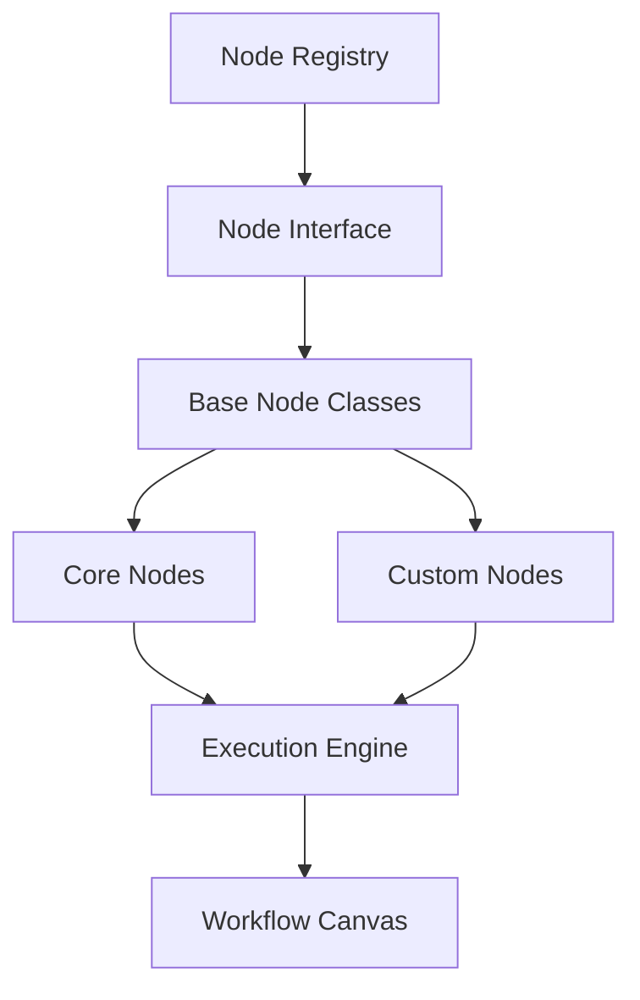

# 🔧 Node System Documentation

Comprehensive guide to the extensible node system architecture of the n8n clone.

## 🎯 Overview

The Node System is the core of the workflow automation platform, providing a modular, extensible architecture for creating and executing workflow components. Each node represents a specific action, trigger, or data transformation that can be connected to build complex workflows.

## 🏗️ Architecture

### Core Components



### Node Interface

All nodes must implement the `NodeInterface` which defines the contract for node behavior.

```php
<?php

namespace App\Nodes\Interfaces;

interface NodeInterface
{
    /**
     * Get the unique identifier for this node type
     */
    public function getId(): string;

    /**
     * Get the display name for this node
     */
    public function getName(): string;

    /**
     * Get the version of this node
     */
    public function getVersion(): string;

    /**
     * Get the category this node belongs to
     */
    public function getCategory(): string;

    /**
     * Get the icon identifier for this node
     */
    public function getIcon(): string;

    /**
     * Get the description of what this node does
     */
    public function getDescription(): string;

    /**
     * Get the properties/configuration schema for this node
     */
    public function getProperties(): array;

    /**
     * Get the input schema for this node
     */
    public function getInputs(): array;

    /**
     * Get the output schema for this node
     */
    public function getOutputs(): array;

    /**
     * Validate the properties for this node
     */
    public function validateProperties(array $properties): bool;

    /**
     * Execute the node with the given context
     */
    public function execute(NodeExecutionContext $context): NodeExecutionResult;

    /**
     * Check if this node can handle the given input data
     */
    public function canHandle(array $inputData): bool;

    /**
     * Get the maximum execution time for this node in seconds
     */
    public function getMaxExecutionTime(): int;

    /**
     * Get the node configuration options
     */
    public function getOptions(): array;

    /**
     * Check if this node supports asynchronous execution
     */
    public function supportsAsync(): bool;

    /**
     * Get the priority level for this node (higher = executed first)
     */
    public function getPriority(): int;

    /**
     * Get the node tags for categorization
     */
    public function getTags(): array;
}
```

## 📦 Node Categories

### 1. Trigger Nodes

Trigger nodes start workflow execution based on external events.

#### Webhook Trigger Node

```php
<?php

namespace App\Nodes\Core;

use App\Nodes\Interfaces\NodeInterface;
use App\Workflow\Execution\NodeExecutionContext;
use App\Workflow\Execution\NodeExecutionResult;

class WebhookTriggerNode implements NodeInterface
{
    public function getId(): string
    {
        return 'webhookTrigger';
    }

    public function getName(): string
    {
        return 'Webhook';
    }

    public function getCategory(): string
    {
        return 'trigger';
    }

    public function getProperties(): array
    {
        return [
            'path' => [
                'type' => 'string',
                'placeholder' => '/webhook/my-endpoint',
                'description' => 'Custom webhook path',
                'required' => false,
            ],
            'method' => [
                'type' => 'select',
                'options' => ['GET', 'POST', 'PUT', 'PATCH'],
                'default' => 'POST',
                'required' => true,
            ],
            'authentication' => [
                'type' => 'select',
                'options' => ['none', 'basic', 'bearer', 'api_key'],
                'default' => 'none',
            ],
            'responseMode' => [
                'type' => 'select',
                'options' => ['immediate', 'delayed'],
                'default' => 'immediate',
                'description' => 'When to respond to the webhook request',
            ],
        ];
    }

    public function execute(NodeExecutionContext $context): NodeExecutionResult
    {
        $properties = $context->getProperties();
        $inputData = $context->getInputData();

        // Generate webhook data
        $webhookData = [
            'webhookId' => uniqid('wh_', true),
            'url' => url($properties['path'] ?? '/webhook/default'),
            'method' => $properties['method'] ?? 'POST',
            'headers' => $inputData['headers'] ?? [],
            'body' => $inputData['body'] ?? [],
            'query' => $inputData['query'] ?? [],
            'timestamp' => now()->toISOString(),
        ];

        return NodeExecutionResult::success([$webhookData]);
    }

    // ... other interface methods
}
```

#### Schedule Trigger Node

```php
<?php

class ScheduleTriggerNode implements NodeInterface
{
    public function getId(): string
    {
        return 'scheduleTrigger';
    }

    public function getName(): string
    {
        return 'Schedule';
    }

    public function getProperties(): array
    {
        return [
            'schedule' => [
                'type' => 'string',
                'placeholder' => '0 */6 * * *',
                'description' => 'Cron expression for scheduling',
                'required' => true,
            ],
            'timezone' => [
                'type' => 'select',
                'options' => \DateTimeZone::listIdentifiers(),
                'default' => 'UTC',
            ],
            'enabled' => [
                'type' => 'boolean',
                'default' => true,
            ],
        ];
    }

    public function execute(NodeExecutionContext $context): NodeExecutionResult
    {
        $properties = $context->getProperties();

        $scheduleData = [
            'schedule_id' => uniqid('sch_', true),
            'cron_expression' => $properties['schedule'],
            'timezone' => $properties['timezone'] ?? 'UTC',
            'next_run' => $this->calculateNextRun($properties['schedule']),
            'executed_at' => now()->toISOString(),
        ];

        return NodeExecutionResult::success([$scheduleData]);
    }
}
```

### 2. Action Nodes

Action nodes perform operations and return results.

#### HTTP Request Node

```php
<?php

class HttpRequestNode implements NodeInterface
{
    public function getId(): string
    {
        return 'httpRequest';
    }

    public function getName(): string
    {
        return 'HTTP Request';
    }

    public function getCategory(): string
    {
        return 'action';
    }

    public function getProperties(): array
    {
        return [
            'method' => [
                'type' => 'select',
                'options' => ['GET', 'POST', 'PUT', 'PATCH', 'DELETE', 'HEAD'],
                'default' => 'GET',
                'required' => true,
            ],
            'url' => [
                'type' => 'string',
                'placeholder' => 'https://api.example.com/endpoint',
                'description' => 'The URL to make the request to',
                'required' => true,
            ],
            'headers' => [
                'type' => 'object',
                'description' => 'Request headers',
            ],
            'body' => [
                'type' => 'object',
                'description' => 'Request body data',
                'condition' => 'method !== "GET" && method !== "HEAD"',
            ],
            'bodyType' => [
                'type' => 'select',
                'options' => ['json', 'form-data', 'raw'],
                'default' => 'json',
                'condition' => 'method !== "GET" && method !== "HEAD"',
            ],
            'timeout' => [
                'type' => 'number',
                'default' => 30,
                'min' => 1,
                'max' => 300,
            ],
            'followRedirects' => [
                'type' => 'boolean',
                'default' => true,
            ],
            'ignoreSSLErrors' => [
                'type' => 'boolean',
                'default' => false,
            ],
        ];
    }

    public function getOutputs(): array
    {
        return [
            'main' => [
                'type' => 'object',
                'description' => 'HTTP response data',
                'properties' => [
                    'statusCode' => ['type' => 'number'],
                    'statusText' => ['type' => 'string'],
                    'headers' => ['type' => 'object'],
                    'body' => ['type' => 'object'],
                    'responseTime' => ['type' => 'number'],
                ],
            ],
            'error' => [
                'type' => 'object',
                'description' => 'Error information if request fails',
            ],
        ];
    }

    public function execute(NodeExecutionContext $context): NodeExecutionResult
    {
        try {
            $properties = $context->getProperties();
            $startTime = microtime(true);

            $client = new \GuzzleHttp\Client([
                'timeout' => $properties['timeout'] ?? 30,
                'allow_redirects' => $properties['followRedirects'] ?? true,
                'verify' => !($properties['ignoreSSLErrors'] ?? false),
            ]);

            $options = [
                'headers' => $properties['headers'] ?? [],
            ];

            // Add body for non-GET requests
            if (!in_array($properties['method'], ['GET', 'HEAD']) && isset($properties['body'])) {
                if (($properties['bodyType'] ?? 'json') === 'json') {
                    $options['json'] = $properties['body'];
                } else {
                    $options['body'] = json_encode($properties['body']);
                }
            }

            $response = $client->request(
                $properties['method'],
                $properties['url'],
                $options
            );

            $responseTime = microtime(true) - $startTime;

            $result = [
                'statusCode' => $response->getStatusCode(),
                'statusText' => $response->getReasonPhrase(),
                'headers' => $this->normalizeHeaders($response->getHeaders()),
                'body' => json_decode((string) $response->getBody(), true),
                'responseTime' => round($responseTime * 1000, 2),
            ];

            return NodeExecutionResult::success([$result]);

        } catch (\Exception $e) {
            return NodeExecutionResult::error($e);
        }
    }

    private function normalizeHeaders(array $headers): array
    {
        $normalized = [];
        foreach ($headers as $name => $values) {
            $normalized[$name] = is_array($values) ? $values[0] : $values;
        }
        return $normalized;
    }
}
```

#### Database Query Node

```php
<?php

class DatabaseQueryNode implements NodeInterface
{
    public function getId(): string
    {
        return 'databaseQuery';
    }

    public function getName(): string
    {
        return 'Database Query';
    }

    public function getCategory(): string
    {
        return 'action';
    }

    public function getProperties(): array
    {
        return [
            'connection' => [
                'type' => 'select',
                'options' => ['mysql', 'pgsql', 'sqlite'],
                'default' => 'mysql',
            ],
            'query_type' => [
                'type' => 'select',
                'options' => ['select', 'insert', 'update', 'delete', 'raw'],
                'default' => 'select',
                'required' => true,
            ],
            'table' => [
                'type' => 'string',
                'placeholder' => 'users',
                'condition' => 'query_type !== "raw"',
            ],
            'columns' => [
                'type' => 'string',
                'placeholder' => 'id, name, email',
                'condition' => 'query_type === "select"',
            ],
            'where' => [
                'type' => 'object',
                'properties' => [
                    'column' => ['type' => 'string'],
                    'operator' => ['type' => 'select', 'options' => ['=', '!=', '>', '<', 'LIKE']],
                    'value' => ['type' => 'string'],
                ],
            ],
            'limit' => [
                'type' => 'number',
                'default' => 100,
                'min' => 1,
                'max' => 10000,
                'condition' => 'query_type === "select"',
            ],
        ];
    }

    public function execute(NodeExecutionContext $context): NodeExecutionResult
    {
        $properties = $context->getProperties();
        $queryType = $properties['query_type'];

        try {
            $result = match ($queryType) {
                'select' => $this->executeSelect($properties),
                'insert' => $this->executeInsert($properties),
                'update' => $this->executeUpdate($properties),
                'delete' => $this->executeDelete($properties),
                'raw' => $this->executeRaw($properties),
            };

            return NodeExecutionResult::success($result);

        } catch (\Exception $e) {
            return NodeExecutionResult::error($e);
        }
    }

    private function executeSelect(array $properties): array
    {
        $query = \DB::connection($properties['connection'] ?? 'mysql')
            ->table($properties['table']);

        if (isset($properties['columns'])) {
            $columns = array_map('trim', explode(',', $properties['columns']));
            $query->select($columns);
        }

        if (isset($properties['where'])) {
            $where = $properties['where'];
            $query->where($where['column'], $where['operator'], $where['value']);
        }

        if (isset($properties['limit'])) {
            $query->limit($properties['limit']);
        }

        return $query->get()->toArray();
    }

    private function executeInsert(array $properties): array
    {
        $data = $properties['data'] ?? [];
        $id = \DB::connection($properties['connection'] ?? 'mysql')
            ->table($properties['table'])
            ->insertGetId($data);

        return ['insert_id' => $id];
    }

    // ... other query methods
}
```

#### Email Node

```php
<?php

class EmailNode implements NodeInterface
{
    public function getId(): string
    {
        return 'email';
    }

    public function getName(): string
    {
        return 'Send Email';
    }

    public function getCategory(): string
    {
        return 'action';
    }

    public function getProperties(): array
    {
        return [
            'to' => [
                'type' => 'string',
                'placeholder' => 'recipient@example.com',
                'required' => true,
            ],
            'subject' => [
                'type' => 'string',
                'placeholder' => 'Email Subject',
                'required' => true,
            ],
            'body' => [
                'type' => 'string',
                'required' => true,
            ],
            'body_type' => [
                'type' => 'select',
                'options' => ['text', 'html'],
                'default' => 'html',
            ],
            'from_email' => [
                'type' => 'string',
                'placeholder' => 'noreply@yourapp.com',
            ],
        ];
    }

    public function execute(NodeExecutionContext $context): NodeExecutionResult
    {
        $properties = $context->getProperties();

        try {
            \Mail::raw($properties['body'], function ($message) use ($properties) {
                $message->to($properties['to'])
                        ->subject($properties['subject']);

                if (isset($properties['from_email'])) {
                    $message->from($properties['from_email']);
                }

                if (($properties['body_type'] ?? 'html') === 'html') {
                    $message->html($properties['body']);
                }
            });

            return NodeExecutionResult::success([
                'message_id' => uniqid('email_', true),
                'sent_at' => now()->toISOString(),
                'recipient' => $properties['to'],
                'success' => true,
            ]);

        } catch (\Exception $e) {
            return NodeExecutionResult::error($e);
        }
    }
}
```

### 3. Transformer Nodes

Transformer nodes manipulate and transform data.

#### JSON Transformer Node

```php
<?php

class JsonTransformerNode implements NodeInterface
{
    public function getId(): string
    {
        return 'jsonTransformer';
    }

    public function getName(): string
    {
        return 'JSON Transformer';
    }

    public function getCategory(): string
    {
        return 'transformer';
    }

    public function getProperties(): array
    {
        return [
            'operation' => [
                'type' => 'select',
                'options' => ['get', 'set', 'delete', 'filter', 'map'],
                'default' => 'get',
                'required' => true,
            ],
            'path' => [
                'type' => 'string',
                'placeholder' => '$.users[*].name',
                'description' => 'JSONPath expression',
                'condition' => 'operation !== "map"',
            ],
            'value' => [
                'type' => 'string',
                'description' => 'Value to set',
                'condition' => 'operation === "set"',
            ],
            'filter_condition' => [
                'type' => 'string',
                'placeholder' => 'item.age > 18',
                'condition' => 'operation === "filter"',
            ],
            'map_expression' => [
                'type' => 'string',
                'placeholder' => 'item.name + " (" + item.age + ")"',
                'condition' => 'operation === "map"',
            ],
        ];
    }

    public function execute(NodeExecutionContext $context): NodeExecutionResult
    {
        $properties = $context->getProperties();
        $inputData = $context->getInputData();

        try {
            $result = match ($properties['operation']) {
                'get' => $this->jsonGet($inputData, $properties['path']),
                'set' => $this->jsonSet($inputData, $properties['path'], $properties['value']),
                'delete' => $this->jsonDelete($inputData, $properties['path']),
                'filter' => $this->jsonFilter($inputData, $properties['filter_condition']),
                'map' => $this->jsonMap($inputData, $properties['map_expression']),
            };

            return NodeExecutionResult::success([$result]);

        } catch (\Exception $e) {
            return NodeExecutionResult::error($e);
        }
    }

    private function jsonGet($data, $path)
    {
        // Implement JSONPath logic
        return $data; // Placeholder
    }

    // ... other transformation methods
}
```

## 🔧 Node Registry

The Node Registry manages all available nodes and provides discovery capabilities.

### Node Registry Implementation

```php
<?php

namespace App\Nodes\Registry;

use App\Nodes\Interfaces\NodeInterface;
use Illuminate\Support\Collection;
use Illuminate\Support\Facades\Cache;

class NodeRegistry
{
    private Collection $nodes;
    private array $categories;

    public function __construct()
    {
        $this->nodes = collect();
        $this->categories = [];
        $this->loadCoreNodes();
        $this->autoDiscover();
    }

    /**
     * Register a node in the registry
     */
    public function register(NodeInterface $node): void
    {
        $nodeId = $node->getId();

        if ($this->has($nodeId)) {
            \Log::warning("Node {$nodeId} is already registered");
            return;
        }

        $this->nodes->put($nodeId, $node);
        $this->categories[$node->getCategory()][] = $nodeId;

        \Log::info("Node {$nodeId} registered successfully");
    }

    /**
     * Get a node by ID
     */
    public function get(string $nodeId): ?NodeInterface
    {
        return $this->nodes->get($nodeId);
    }

    /**
     * Get all registered nodes
     */
    public function all(): Collection
    {
        return $this->nodes;
    }

    /**
     * Get nodes by category
     */
    public function getByCategory(string $category): Collection
    {
        $nodeIds = $this->categories[$category] ?? [];
        return $this->nodes->only($nodeIds);
    }

    /**
     * Get node manifest for API
     */
    public function getManifest(): array
    {
        return $this->nodes->map(function (NodeInterface $node) {
            return [
                'id' => $node->getId(),
                'name' => $node->getName(),
                'version' => $node->getVersion(),
                'category' => $node->getCategory(),
                'icon' => $node->getIcon(),
                'description' => $node->getDescription(),
                'properties' => $node->getProperties(),
                'inputs' => $node->getInputs(),
                'outputs' => $node->getOutputs(),
                'tags' => $node->getTags(),
                'supports_async' => $node->supportsAsync(),
                'max_execution_time' => $node->getMaxExecutionTime(),
            ];
        })->values()->toArray();
    }

    /**
     * Load core nodes
     */
    private function loadCoreNodes(): void
    {
        $coreNodes = [
            \App\Nodes\Core\WebhookTriggerNode::class,
            \App\Nodes\Core\HttpRequestNode::class,
            \App\Nodes\Core\DatabaseQueryNode::class,
            \App\Nodes\Core\EmailNode::class,
        ];

        foreach ($coreNodes as $nodeClass) {
            if (class_exists($nodeClass)) {
                try {
                    $node = new $nodeClass();
                    $this->register($node);
                } catch (\Throwable $e) {
                    \Log::error("Failed to register node {$nodeClass}", [
                        'error' => $e->getMessage(),
                    ]);
                }
            }
        }
    }

    /**
     * Auto-discover nodes from directories
     */
    private function autoDiscover(): void
    {
        $directories = [
            app_path('Nodes/Core'),
            app_path('Nodes/Custom'),
        ];

        foreach ($directories as $directory) {
            if (!is_dir($directory)) {
                continue;
            }

            $files = glob($directory . '/*.php');
            foreach ($files as $file) {
                $className = $this->getClassNameFromFile($file);
                if ($className && $this->isValidNodeClass($className)) {
                    try {
                        $node = new $className();
                        $this->register($node);
                    } catch (\Throwable $e) {
                        \Log::error("Failed to auto-discover node from {$file}", [
                            'class' => $className,
                            'error' => $e->getMessage(),
                        ]);
                    }
                }
            }
        }
    }
}
```

## 🎨 Node Execution Context

The execution context provides runtime information to nodes.

```php
<?php

namespace App\Workflow\Execution;

use App\Models\Execution;
use App\Models\User;
use App\Models\Workflow;

class NodeExecutionContext
{
    private Workflow $workflow;
    private Execution $execution;
    private User $user;
    private string $nodeId;
    private array $nodeData;
    private array $inputData;
    private array $properties;

    public function __construct(
        Workflow $workflow,
        Execution $execution,
        User $user,
        string $nodeId,
        array $nodeData,
        array $inputData,
        array $properties
    ) {
        $this->workflow = $workflow;
        $this->execution = $execution;
        $this->user = $user;
        $this->nodeId = $nodeId;
        $this->nodeData = $nodeData;
        $this->inputData = $inputData;
        $this->properties = $properties;
    }

    public function getWorkflow(): Workflow
    {
        return $this->workflow;
    }

    public function getExecution(): Execution
    {
        return $this->execution;
    }

    public function getUser(): User
    {
        return $this->user;
    }

    public function getNodeId(): string
    {
        return $this->nodeId;
    }

    public function getNodeData(): array
    {
        return $this->nodeData;
    }

    public function getInputData(): array
    {
        return $this->inputData;
    }

    public function getProperties(): array
    {
        return $this->properties;
    }

    public function log(string $message, array $context = []): void
    {
        \App\Models\ExecutionLog::log(
            $this->execution,
            $this->nodeId,
            'info',
            $message,
            $context
        );
    }

    public function getOrganization()
    {
        return $this->workflow->organization;
    }

    public function getCredentials(string $type = null): array
    {
        $query = $this->workflow->organization->credentials();

        if ($type) {
            $query->where('type', $type);
        }

        return $query->get()->toArray();
    }
}
```

## 📊 Node Execution Result

Standardized result format for node execution.

```php
<?php

namespace App\Workflow\Execution;

use Exception;

class NodeExecutionResult
{
    private bool $success;
    private array $outputData;
    private ?string $errorMessage;
    private ?Exception $exception;

    public function __construct(
        bool $success,
        array $outputData = [],
        ?string $errorMessage = null,
        ?Exception $exception = null
    ) {
        $this->success = $success;
        $this->outputData = $outputData;
        $this->errorMessage = $errorMessage;
        $this->exception = $exception;
    }

    public static function success(array $outputData = []): self
    {
        return new self(true, $outputData, null, null);
    }

    public static function error(Exception $exception): self
    {
        return new self(false, [], $exception->getMessage(), $exception);
    }

    public function isSuccess(): bool
    {
        return $this->success;
    }

    public function getOutputData(): array
    {
        return $this->outputData;
    }

    public function getErrorMessage(): ?string
    {
        return $this->errorMessage;
    }

    public function getException(): ?Exception
    {
        return $this->exception;
    }
}
```

## 🛠️ Creating Custom Nodes

### Step 1: Create Node Class

```php
<?php

namespace App\Nodes\Custom;

use App\Nodes\Interfaces\NodeInterface;
use App\Workflow\Execution\NodeExecutionContext;
use App\Workflow\Execution\NodeExecutionResult;

class SlackMessageNode implements NodeInterface
{
    public function getId(): string
    {
        return 'slackMessage';
    }

    public function getName(): string
    {
        return 'Slack Message';
    }

    public function getVersion(): string
    {
        return '1.0.0';
    }

    public function getCategory(): string
    {
        return 'action';
    }

    public function getIcon(): string
    {
        return 'slack';
    }

    public function getDescription(): string
    {
        return 'Send messages to Slack channels';
    }

    public function getProperties(): array
    {
        return [
            'channel' => [
                'type' => 'string',
                'placeholder' => '#general',
                'required' => true,
            ],
            'message' => [
                'type' => 'string',
                'required' => true,
            ],
            'username' => [
                'type' => 'string',
                'placeholder' => 'Workflow Bot',
            ],
            'icon_emoji' => [
                'type' => 'string',
                'placeholder' => ':robot_face:',
            ],
        ];
    }

    public function getInputs(): array
    {
        return [
            'main' => [
                'type' => 'object',
                'description' => 'Message data from previous nodes',
            ],
        ];
    }

    public function getOutputs(): array
    {
        return [
            'main' => [
                'type' => 'object',
                'description' => 'Slack API response',
            ],
        ];
    }

    public function validateProperties(array $properties): bool
    {
        return !empty($properties['channel']) && !empty($properties['message']);
    }

    public function execute(NodeExecutionContext $context): NodeExecutionResult
    {
        try {
            $properties = $context->getProperties();

            // Get Slack credentials
            $credentials = $context->getCredentials('api_key');
            $slackToken = null;

            foreach ($credentials as $credential) {
                if (str_contains($credential['name'], 'Slack')) {
                    $slackToken = $credential['data']['api_key'] ?? null;
                    break;
                }
            }

            if (!$slackToken) {
                throw new \Exception('No Slack credentials found');
            }

            // Send message to Slack
            $response = $this->sendSlackMessage(
                $slackToken,
                $properties['channel'],
                $properties['message'],
                $properties['username'] ?? 'Workflow Bot',
                $properties['icon_emoji'] ?? ':robot_face:'
            );

            return NodeExecutionResult::success([$response]);

        } catch (\Exception $e) {
            $context->log('Slack message failed', [
                'error' => $e->getMessage(),
            ]);

            return NodeExecutionResult::error($e);
        }
    }

    private function sendSlackMessage($token, $channel, $message, $username, $iconEmoji)
    {
        // Implement Slack API call
        return [
            'channel' => $channel,
            'message' => $message,
            'timestamp' => now()->toISOString(),
            'success' => true,
        ];
    }

    public function canHandle(array $inputData): bool
    {
        return true;
    }

    public function getMaxExecutionTime(): int
    {
        return 30;
    }

    public function getOptions(): array
    {
        return [
            'retryable' => true,
            'isTrigger' => false,
            'slackEnabled' => true,
        ];
    }

    public function supportsAsync(): bool
    {
        return false;
    }

    public function getPriority(): int
    {
        return 3;
    }

    public function getTags(): array
    {
        return ['slack', 'message', 'notification', 'communication'];
    }
}
```

### Step 2: Register Node

The node will be automatically discovered by the NodeRegistry if placed in:
- `app/Nodes/Core/` (for core nodes)
- `app/Nodes/Custom/` (for custom nodes)

### Step 3: Test Node

```php
// Test the node
$node = new SlackMessageNode();
$context = new NodeExecutionContext(/* ... */);
$result = $node->execute($context);

if ($result->isSuccess()) {
    echo "Message sent successfully!";
} else {
    echo "Error: " . $result->getErrorMessage();
}
```

## 🔧 Node Property Types

### Basic Property Types

```php
[
    'string' => [
        'type' => 'string',
        'placeholder' => 'Enter text here',
        'description' => 'Text input field',
        'required' => false,
        'default' => '',
        'minLength' => 1,
        'maxLength' => 255,
    ],
    'number' => [
        'type' => 'number',
        'description' => 'Numeric input',
        'default' => 0,
        'min' => 0,
        'max' => 100,
        'step' => 1,
    ],
    'boolean' => [
        'type' => 'boolean',
        'description' => 'Yes/No toggle',
        'default' => false,
    ],
    'select' => [
        'type' => 'select',
        'options' => ['option1', 'option2', 'option3'],
        'default' => 'option1',
        'multiple' => false,
    ],
]
```

### Advanced Property Types

```php
[
    'textarea' => [
        'type' => 'textarea',
        'placeholder' => 'Enter long text here',
        'rows' => 4,
    ],
    'code' => [
        'type' => 'code',
        'language' => 'javascript',
        'placeholder' => 'function() { return true; }',
    ],
    'file' => [
        'type' => 'file',
        'accept' => '.json,.csv,.txt',
        'maxSize' => 10485760, // 10MB
    ],
    'date' => [
        'type' => 'date',
        'format' => 'Y-m-d',
    ],
    'datetime' => [
        'type' => 'datetime',
        'timezone' => true,
    ],
]
```

### Conditional Properties

```php
[
    'method' => [
        'type' => 'select',
        'options' => ['GET', 'POST', 'PUT', 'DELETE'],
        'default' => 'GET',
    ],
    'body' => [
        'type' => 'textarea',
        'condition' => 'method !== "GET"', // Only show for non-GET methods
    ],
    'api_key' => [
        'type' => 'string',
        'condition' => 'authentication === "api_key"', // Show based on another field
    ],
]
```

## 📊 Node Statistics & Monitoring

### Execution Metrics

```php
class NodeMetrics
{
    public static function recordExecution(
        string $nodeId,
        string $nodeType,
        float $executionTime,
        bool $success,
        ?string $error = null
    ): void {
        \DB::table('node_metrics')->insert([
            'node_id' => $nodeId,
            'node_type' => $nodeType,
            'execution_time' => $executionTime,
            'success' => $success,
            'error_message' => $error,
            'executed_at' => now(),
        ]);
    }

    public static function getNodeStats(string $nodeId): array
    {
        return \DB::table('node_metrics')
            ->where('node_id', $nodeId)
            ->selectRaw('
                COUNT(*) as total_executions,
                AVG(execution_time) as avg_execution_time,
                MAX(execution_time) as max_execution_time,
                MIN(execution_time) as min_execution_time,
                SUM(CASE WHEN success = 1 THEN 1 ELSE 0 END) / COUNT(*) * 100 as success_rate
            ')
            ->first();
    }
}
```

### Node Health Monitoring

```php
class NodeHealthMonitor
{
    public static function checkNodeHealth(NodeInterface $node): array
    {
        $health = [
            'node_id' => $node->getId(),
            'status' => 'healthy',
            'issues' => [],
        ];

        // Check if node implements required methods
        $reflection = new \ReflectionClass($node);
        $requiredMethods = [
            'getId', 'getName', 'getProperties', 'execute'
        ];

        foreach ($requiredMethods as $method) {
            if (!$reflection->hasMethod($method)) {
                $health['issues'][] = "Missing required method: {$method}";
                $health['status'] = 'unhealthy';
            }
        }

        // Check property validation
        try {
            $properties = $node->getProperties();
            $isValid = $node->validateProperties($properties);
            if (!$isValid) {
                $health['issues'][] = 'Property validation failed';
                $health['status'] = 'warning';
            }
        } catch (\Exception $e) {
            $health['issues'][] = 'Property validation error: ' . $e->getMessage();
            $health['status'] = 'error';
        }

        return $health;
    }
}
```

## 🚀 Advanced Node Features

### Asynchronous Execution

```php
class AsyncHttpRequestNode implements NodeInterface
{
    public function supportsAsync(): bool
    {
        return true;
    }

    public function execute(NodeExecutionContext $context): NodeExecutionResult
    {
        $properties = $context->getProperties();

        // Queue async job
        \App\Jobs\ProcessHttpRequest::dispatch(
            $context->getExecution()->id,
            $context->getNodeId(),
            $properties
        );

        // Return immediate response
        return NodeExecutionResult::success([
            'job_queued' => true,
            'estimated_completion' => now()->addSeconds(30)->toISOString(),
        ]);
    }
}
```

### Streaming Data Processing

```php
class StreamingDataNode implements NodeInterface
{
    public function execute(NodeExecutionContext $context): NodeExecutionResult
    {
        $inputData = $context->getInputData();

        // Process data in chunks
        $results = [];
        $chunkSize = 100;

        foreach (array_chunk($inputData, $chunkSize) as $chunk) {
            $processedChunk = $this->processChunk($chunk);
            $results = array_merge($results, $processedChunk);

            // Yield progress
            $context->log("Processed chunk", [
                'chunk_size' => count($chunk),
                'total_processed' => count($results),
            ]);
        }

        return NodeExecutionResult::success($results);
    }

    private function processChunk(array $chunk): array
    {
        // Implement chunk processing logic
        return array_map(function ($item) {
            // Process individual item
            return $item;
        }, $chunk);
    }
}
```

## 📚 Node Development Best Practices

### 1. Error Handling
```php
public function execute(NodeExecutionContext $context): NodeExecutionResult
{
    try {
        // Node logic here
        $result = $this->performOperation();

        $context->log('Operation completed successfully', [
            'result_count' => count($result),
        ]);

        return NodeExecutionResult::success($result);

    } catch (\App\Exceptions\NodeException $e) {
        $context->log('Node-specific error', [
            'error_code' => $e->getCode(),
            'error_details' => $e->getDetails(),
        ]);

        return NodeExecutionResult::error($e);

    } catch (\Exception $e) {
        $context->log('Unexpected error', [
            'error_type' => get_class($e),
            'error_message' => $e->getMessage(),
        ]);

        return NodeExecutionResult::error($e);
    }
}
```

### 2. Resource Management
```php
public function execute(NodeExecutionContext $context): NodeExecutionResult
{
    $startTime = microtime(true);
    $startMemory = memory_get_usage();

    try {
        // Node execution logic
        $result = $this->executeWithResourceLimits();

        // Log resource usage
        $executionTime = microtime(true) - $startTime;
        $memoryUsed = memory_get_usage() - $startMemory;

        $context->log('Execution completed', [
            'execution_time_ms' => round($executionTime * 1000, 2),
            'memory_used_mb' => round($memoryUsed / 1024 / 1024, 2),
        ]);

        return NodeExecutionResult::success($result);

    } finally {
        // Cleanup resources
        $this->cleanup();
    }
}
```

### 3. Input Validation
```php
public function validateProperties(array $properties): bool
{
    // Required field validation
    if (empty($properties['api_url'])) {
        return false;
    }

    // URL validation
    if (!filter_var($properties['api_url'], FILTER_VALIDATE_URL)) {
        return false;
    }

    // Email validation for optional fields
    if (!empty($properties['notify_email'])) {
        if (!filter_var($properties['notify_email'], FILTER_VALIDATE_EMAIL)) {
            return false;
        }
    }

    // Custom business logic validation
    if (($properties['timeout'] ?? 30) > $this->getMaxExecutionTime()) {
        return false;
    }

    return true;
}
```

### 4. Documentation
```php
/**
 * Advanced HTTP Request Node
 *
 * This node makes HTTP requests to external APIs with advanced features:
 * - Multiple authentication methods (Basic, Bearer, API Key, OAuth)
 * - Request/response transformation
 * - Retry logic with exponential backoff
 * - Rate limiting and circuit breaker patterns
 *
 * @example
 * ```php
 * $node = new HttpRequestNode();
 * $properties = [
 *     'method' => 'POST',
 *     'url' => 'https://api.example.com/webhook',
 *     'headers' => ['Content-Type' => 'application/json'],
 *     'body' => ['event' => 'user.created', 'user_id' => 123],
 *     'authentication' => 'bearer',
 *     'bearer_token' => 'abc123...',
 *     'timeout' => 30,
 *     'retry_count' => 3,
 * ];
 * ```
 */
class HttpRequestNode implements NodeInterface
{
    // ... implementation
}
```

---

**🔧 The Node System provides a powerful, extensible foundation for building workflow automation capabilities with enterprise-grade features and developer-friendly APIs.**
