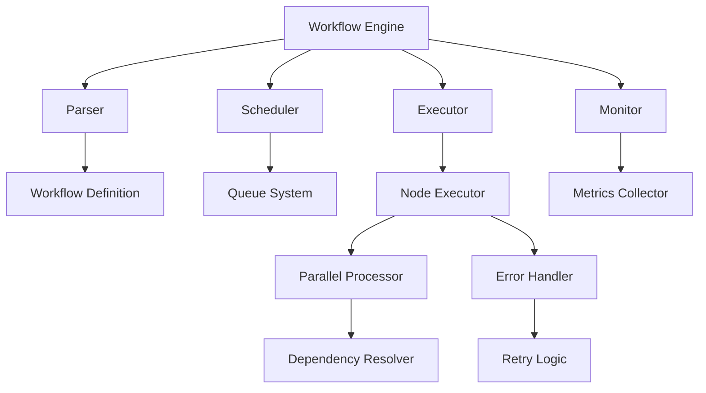

# ⚙️ Workflow Engine Documentation

Comprehensive guide to the workflow execution engine and pipeline architecture.

## 🎯 Overview

The Workflow Engine is the core execution system that manages the entire lifecycle of workflow automation, from trigger activation to final result delivery. It handles complex execution patterns, error recovery, parallel processing, and performance optimization.

## 🏗️ Engine Architecture

### Core Components



### Execution Pipeline

```mermaid
graph LR
    A[Trigger Event] --> B[Workflow Validation]
    B --> C[Resource Allocation]
    C --> D[Dependency Analysis]
    D --> E[Node Execution Queue]
    E --> F[Parallel Execution]
    F --> G[Result Aggregation]
    G --> H[Error Handling]
    H --> I[Metrics Recording]
    I --> J[Completion Callback]
```



## 🔧 Core Classes

### WorkflowExecutionEngine

The main engine that orchestrates workflow execution.

```php
<?php

namespace App\Workflow\Engine;

use App\Jobs\ProcessWorkflowExecution;
use App\Models\Execution;
use App\Models\Workflow;
use App\Nodes\Interfaces\NodeInterface;
use App\Nodes\Registry\NodeRegistry;
use App\Queue\QueueManager;
use App\Workflow\Execution\ExecutionResult;
use App\Workflow\Execution\NodeExecutionContext;
use App\Workflow\Execution\NodeExecutionResult;
use Illuminate\Support\Collection;
use Illuminate\Support\Facades\Log;
use Throwable;

class WorkflowExecutionEngine
{
    private NodeRegistry $nodeRegistry;
    private ExecutionTracker $tracker;
    private QueueManager $queueManager;

    public function __construct(
        NodeRegistry $nodeRegistry,
        QueueManager $queueManager = null
    ) {
        $this->nodeRegistry = $nodeRegistry;
        $this->tracker = new ExecutionTracker();
        $this->queueManager = $queueManager ?? app(QueueManager::class);
    }

    /**
     * Execute a workflow synchronously
     */
    public function executeWorkflowSync(
        Workflow $workflow,
        array $triggerData = []
    ): ExecutionResult {
        $execution = $this->createExecution($workflow);
        $startTime = microtime(true);

        try {
            Log::info("Starting workflow execution", [
                'workflow_id' => $workflow->id,
                'execution_id' => $execution->id,
            ]);

            // Parse workflow structure
            $workflowStructure = $this->parseWorkflowStructure($workflow);

            // Execute workflow
            $result = $this->executeWorkflowStructure(
                $workflow,
                $execution,
                $workflowStructure,
                $triggerData
            );

            $executionTime = microtime(true) - $startTime;

            // Update execution record
            $execution->update([
                'status' => $result->isSuccess() ? 'success' : 'error',
                'finished_at' => now(),
                'duration' => (int)($executionTime * 1000),
                'output_data' => $result->getOutputData(),
                'error_message' => $result->getErrorMessage(),
            ]);

            Log::info("Workflow execution completed", [
                'workflow_id' => $workflow->id,
                'execution_id' => $execution->id,
                'status' => $execution->status,
                'execution_time' => $executionTime,
            ]);

            return $result;

        } catch (Throwable $e) {
            $executionTime = microtime(true) - $startTime;

            Log::error("Workflow execution failed", [
                'workflow_id' => $workflow->id,
                'execution_id' => $execution->id,
                'error' => $e->getMessage(),
            ]);

            $execution->update([
                'status' => 'error',
                'finished_at' => now(),
                'duration' => (int)($executionTime * 1000),
                'error_message' => $e->getMessage(),
            ]);

            return ExecutionResult::error($e);
        }
    }

    /**
     * Dispatch workflow execution to queue (asynchronous)
     */
    public function dispatchWorkflowExecution(
        Workflow $workflow,
        array $triggerData = [],
        string $priority = 'normal'
    ): string {
        $execution = $this->createExecution($workflow);

        Log::info('Dispatching workflow execution to queue', [
            'workflow_id' => $workflow->id,
            'execution_id' => $execution->id,
            'priority' => $priority,
        ]);

        return $this->queueManager->dispatchWorkflowExecutionWithRecord(
            $workflow,
            $execution->id,
            $triggerData,
            $priority
        );
    }

    /**
     * Execute a single node
     */
    public function executeNode(
        Workflow $workflow,
        Execution $execution,
        string $nodeId,
        array $nodeData,
        array $inputData = []
    ): NodeExecutionResult {
        $startTime = microtime(true);

        try {
            // Get node instance
            $nodeType = $nodeData['type'] ?? '';
            $node = $this->nodeRegistry->get($nodeType);

            if (!$node) {
                throw new \Exception("Node type '{$nodeType}' not found in registry");
            }

            // Create execution context
            $context = new NodeExecutionContext(
                $workflow,
                $execution,
                $execution->user,
                $nodeId,
                $nodeData,
                $inputData,
                $nodeData['properties'] ?? []
            );

            // Execute node
            $result = $node->execute($context);
            $executionTime = microtime(true) - $startTime;

            // Track execution
            $this->tracker->trackNodeExecution($execution, $nodeId, $result, $executionTime);

            Log::debug("Node execution completed", [
                'node_id' => $nodeId,
                'node_type' => $nodeType,
                'execution_time' => $executionTime,
                'success' => $result->isSuccess(),
            ]);

            return $result;

        } catch (Throwable $e) {
            $executionTime = microtime(true) - $startTime;

            Log::error("Node execution failed", [
                'node_id' => $nodeId,
                'node_type' => $nodeData['type'] ?? 'unknown',
                'error' => $e->getMessage(),
                'execution_time' => $executionTime,
            ]);

            $result = NodeExecutionResult::error($e);
            $this->tracker->trackNodeExecution($execution, $nodeId, $result, $executionTime);

            return $result;
        }
    }

    /**
     * Parse workflow structure from JSON
     */
    private function parseWorkflowStructure(Workflow $workflow): array
    {
        $workflowData = $workflow->workflow_data ?? [];

        return [
            'nodes' => $workflowData['nodes'] ?? [],
            'connections' => $workflowData['connections'] ?? [],
            'settings' => $workflowData['settings'] ?? [],
        ];
    }

    /**
     * Execute workflow structure with dependency resolution
     */
    private function executeWorkflowStructure(
        Workflow $workflow,
        Execution $execution,
        array $workflowStructure,
        array $triggerData
    ): ExecutionResult {
        $nodes = collect($workflowStructure['nodes']);
        $connections = collect($workflowStructure['connections']);

        // Find trigger nodes (nodes with no incoming connections)
        $triggerNodes = $this->findTriggerNodes($nodes, $connections);

        if (empty($triggerNodes)) {
            throw new \Exception("No trigger nodes found in workflow");
        }

        // Execute trigger nodes first
        $results = [];
        foreach ($triggerNodes as $triggerNode) {
            $nodeData = $nodes->firstWhere('id', $triggerNode);

            if ($nodeData) {
                $result = $this->executeNode(
                    $workflow,
                    $execution,
                    $triggerNode,
                    $nodeData,
                    $triggerData
                );
                $results[$triggerNode] = $result;

                if (!$result->isSuccess()) {
                    return ExecutionResult::error(
                        new \Exception("Trigger node '{$triggerNode}' failed: " . $result->getErrorMessage())
                    );
                }
            }
        }

        // Execute subsequent nodes based on connections
        $executedNodes = array_keys($results);
        $maxIterations = 100; // Prevent infinite loops
        $iteration = 0;

        while ($iteration < $maxIterations) {
            $newlyExecutedNodes = [];

            foreach ($connections as $connection) {
                $sourceNodeId = $connection['source'] ?? '';
                $targetNodeId = $connection['target'] ?? '';

                // Skip if source node hasn't been executed yet
                if (!in_array($sourceNodeId, $executedNodes)) {
                    continue;
                }

                // Skip if target node has already been executed
                if (in_array($targetNodeId, $executedNodes)) {
                    continue;
                }

                // Get source node result
                $sourceResult = $results[$sourceNodeId] ?? null;
                if (!$sourceResult || !$sourceResult->isSuccess()) {
                    continue;
                }

                // Execute target node
                $targetNodeData = $nodes->firstWhere('id', $targetNodeId);
                if ($targetNodeData) {
                    $inputData = $sourceResult->getOutputData();
                    $result = $this->executeNode(
                        $workflow,
                        $execution,
                        $targetNodeId,
                        $targetNodeData,
                        $inputData
                    );

                    $results[$targetNodeId] = $result;
                    $newlyExecutedNodes[] = $targetNodeId;

                    if (!$result->isSuccess()) {
                        Log::warning("Node '{$targetNodeId}' execution failed", [
                            'error' => $result->getErrorMessage(),
                        ]);
                        // Continue with other nodes instead of failing completely
                    }
                }
            }

            if (empty($newlyExecutedNodes)) {
                break; // No more nodes to execute
            }

            $executedNodes = array_merge($executedNodes, $newlyExecutedNodes);
            $iteration++;
        }

        if ($iteration >= $maxIterations) {
            Log::warning("Workflow execution stopped due to maximum iterations reached", [
                'workflow_id' => $workflow->id,
                'execution_id' => $execution->id,
            ]);
        }

        // Collect final results
        $finalResults = [];
        foreach ($results as $nodeId => $result) {
            if ($result->isSuccess()) {
                $finalResults = array_merge($finalResults, $result->getOutputData());
            }
        }

        return ExecutionResult::success($finalResults);
    }

    /**
     * Find trigger nodes (nodes with no incoming connections)
     */
    private function findTriggerNodes(Collection $nodes, Collection $connections): array
    {
        $allNodeIds = $nodes->pluck('id')->toArray();
        $targetNodeIds = $connections->pluck('target')->unique()->toArray();

        return array_diff($allNodeIds, $targetNodeIds);
    }

    /**
     * Create execution record
     */
    private function createExecution(Workflow $workflow): Execution
    {
        return Execution::create([
            'workflow_id' => $workflow->id,
            'organization_id' => $workflow->organization_id,
            'user_id' => $workflow->user_id,
            'execution_id' => uniqid('exec_'),
            'status' => 'running',
            'mode' => 'api',
            'started_at' => now(),
        ]);
    }

    /**
     * Validate workflow structure
     */
    public function validateWorkflow(Workflow $workflow): array
    {
        $errors = [];
        $warnings = [];

        $workflowData = $workflow->workflow_data ?? [];

        if (empty($workflowData['nodes'])) {
            $errors[] = 'Workflow must contain at least one node';
        }

        // Validate each node
        foreach ($workflowData['nodes'] ?? [] as $nodeData) {
            $nodeType = $nodeData['type'] ?? '';

            if (!$this->nodeRegistry->has($nodeType)) {
                $errors[] = "Unknown node type: {$nodeType}";
                continue;
            }

            $node = $this->nodeRegistry->get($nodeType);
            $properties = $nodeData['properties'] ?? [];

            if (!$node->validateProperties($properties)) {
                $errors[] = "Invalid properties for node type: {$nodeType}";
            }
        }

        // Check for circular dependencies
        if ($this->hasCircularDependencies($workflowData)) {
            $errors[] = 'Workflow contains circular dependencies';
        }

        return [
            'valid' => empty($errors),
            'errors' => $errors,
            'warnings' => $warnings,
        ];
    }

    /**
     * Check for circular dependencies in workflow
     */
    private function hasCircularDependencies(array $workflowData): bool
    {
        $connections = $workflowData['connections'] ?? [];
        $graph = [];

        // Build adjacency list
        foreach ($connections as $connection) {
            $source = $connection['source'] ?? '';
            $target = $connection['target'] ?? '';

            if (!isset($graph[$source])) {
                $graph[$source] = [];
            }
            $graph[$source][] = $target;
        }

        // Check for cycles using DFS
        $visited = [];
        $recursionStack = [];

        foreach (array_keys($graph) as $node) {
            if ($this->hasCycle($node, $graph, $visited, $recursionStack)) {
                return true;
            }
        }

        return false;
    }

    /**
     * DFS helper for cycle detection
     */
    private function hasCycle(string $node, array $graph, array &$visited, array &$recursionStack): bool
    {
        if (in_array($node, $recursionStack)) {
            return true;
        }

        if (in_array($node, $visited)) {
            return false;
        }

        $visited[] = $node;
        $recursionStack[] = $node;

        if (isset($graph[$node])) {
            foreach ($graph[$node] as $neighbor) {
                if ($this->hasCycle($neighbor, $graph, $visited, $recursionStack)) {
                    return true;
                }
            }
        }

        array_pop($recursionStack);
        return false;
    }
}
```

### ExecutionTracker

Tracks node execution metrics and performance.

```php
<?php

namespace App\Workflow\Engine;

use App\Models\Execution;
use App\Models\ExecutionLog;
use App\Workflow\Execution\NodeExecutionResult;

class ExecutionTracker
{
    /**
     * Track node execution
     */
    public function trackNodeExecution(
        Execution $execution,
        string $nodeId,
        NodeExecutionResult $result,
        float $executionTime
    ): void {
        // Log execution metrics
        ExecutionLog::create([
            'execution_id' => $execution->id,
            'node_id' => $nodeId,
            'level' => $result->isSuccess() ? 'info' : 'error',
            'message' => $result->isSuccess()
                ? "Node executed successfully in {$executionTime}ms"
                : "Node execution failed: " . $result->getErrorMessage(),
            'context' => [
                'execution_time' => round($executionTime * 1000, 2),
                'success' => $result->isSuccess(),
                'output_count' => count($result->getOutputData()),
            ],
            'timestamp' => now(),
        ]);

        // Update execution metadata
        $metadata = $execution->metadata ?? [];
        $metadata['node_executions'] = ($metadata['node_executions'] ?? 0) + 1;
        $metadata['total_execution_time'] = ($metadata['total_execution_time'] ?? 0) + $executionTime;

        if (!$result->isSuccess()) {
            $metadata['failed_nodes'] = ($metadata['failed_nodes'] ?? 0) + 1;
        }

        $execution->update(['metadata' => $metadata]);
    }

    /**
     * Get execution statistics
     */
    public function getExecutionStats(Execution $execution): array
    {
        $logs = $execution->logs;

        return [
            'total_nodes' => $logs->count(),
            'successful_nodes' => $logs->where('level', 'info')->count(),
            'failed_nodes' => $logs->where('level', 'error')->count(),
            'total_execution_time' => $logs->sum(function ($log) {
                return $log->context['execution_time'] ?? 0;
            }),
            'average_node_time' => $logs->avg(function ($log) {
                return $log->context['execution_time'] ?? 0;
            }),
        ];
    }
}
```

## 🔄 Execution Pipeline

### Synchronous Execution

```php
// Execute workflow immediately
$result = $executionEngine->executeWorkflowSync($workflow, [
    'user_id' => 123,
    'action' => 'create_user',
]);

if ($result->isSuccess()) {
    $outputData = $result->getOutputData();
    // Process successful execution
} else {
    $error = $result->getErrorMessage();
    // Handle execution error
}
```

### Asynchronous Execution

```php
// Queue workflow for execution
$jobId = $executionEngine->dispatchWorkflowExecution(
    $workflow,
    ['data' => 'payload'],
    'high' // Priority
);

// Monitor execution status
$execution = Execution::where('execution_id', $jobId)->first();
$status = $execution->status; // waiting, running, success, error
```

### Parallel Execution

```php
class ParallelExecutionManager
{
    private array $workers = [];
    private array $results = [];

    public function executeParallelNodes(
        array $nodes,
        ExecutionContext $context
    ): array {
        $promises = [];

        foreach ($nodes as $nodeId => $nodeData) {
            $promises[$nodeId] = $this->executeNodeAsync($nodeId, $nodeData, $context);
        }

        // Wait for all promises to complete
        foreach ($promises as $nodeId => $promise) {
            try {
                $this->results[$nodeId] = $promise->wait();
            } catch (\Exception $e) {
                $this->results[$nodeId] = NodeExecutionResult::error($e);
            }
        }

        return $this->results;
    }

    private function executeNodeAsync($nodeId, $nodeData, $context)
    {
        return \React\Promise\resolve(
            $this->executionEngine->executeNode(
                $context->getWorkflow(),
                $context->getExecution(),
                $nodeId,
                $nodeData,
                $context->getInputData()
            )
        );
    }
}
```

## 📊 Execution Monitoring

### Real-time Metrics

```php
class ExecutionMetricsCollector
{
    public static function collectExecutionMetrics(Execution $execution): void
    {
        $metrics = [
            'execution_id' => $execution->id,
            'workflow_id' => $execution->workflow_id,
            'organization_id' => $execution->organization_id,
            'duration' => $execution->duration,
            'status' => $execution->status,
            'node_count' => $execution->logs()->count(),
            'error_count' => $execution->logs()->where('level', 'error')->count(),
            'success_rate' => self::calculateSuccessRate($execution),
            'timestamp' => now(),
        ];

        // Store in time-series database (e.g., InfluxDB, TimescaleDB)
        self::storeMetrics($metrics);

        // Send to monitoring system
        self::sendToMonitoring($metrics);

        // Check thresholds and send alerts
        self::checkThresholds($metrics);
    }

    private static function calculateSuccessRate(Execution $execution): float
    {
        $totalLogs = $execution->logs()->count();
        if ($totalLogs === 0) return 0;

        $successLogs = $execution->logs()->where('level', 'info')->count();
        return round(($successLogs / $totalLogs) * 100, 2);
    }

    private static function storeMetrics(array $metrics): void
    {
        // Store in metrics database
        \DB::connection('metrics')->table('execution_metrics')->insert($metrics);
    }

    private static function sendToMonitoring(array $metrics): void
    {
        // Send to external monitoring (DataDog, New Relic, etc.)
        if (config('monitoring.enabled')) {
            \Monitoring::gauge('workflow.execution.duration', $metrics['duration'], [
                'workflow_id' => $metrics['workflow_id'],
                'status' => $metrics['status'],
            ]);

            \Monitoring::increment('workflow.execution.count', [
                'status' => $metrics['status'],
            ]);
        }
    }

    private static function checkThresholds(array $metrics): void
    {
        $thresholds = config('monitoring.thresholds');

        // Check execution time threshold
        if ($metrics['duration'] > $thresholds['max_execution_time']) {
            self::sendAlert('Execution time exceeded threshold', [
                'execution_id' => $metrics['execution_id'],
                'duration' => $metrics['duration'],
                'threshold' => $thresholds['max_execution_time'],
            ]);
        }

        // Check error rate threshold
        if ($metrics['success_rate'] < $thresholds['min_success_rate']) {
            self::sendAlert('Execution success rate below threshold', [
                'execution_id' => $metrics['execution_id'],
                'success_rate' => $metrics['success_rate'],
                'threshold' => $thresholds['min_success_rate'],
            ]);
        }
    }

    private static function sendAlert(string $message, array $context): void
    {
        \Log::warning($message, $context);

        // Send alert to external system
        if (config('alerts.enabled')) {
            \Notification::route('slack', config('alerts.slack_webhook'))
                ->notify(new ExecutionAlert($message, $context));
        }
    }
}
```

### Performance Monitoring

```php
class PerformanceMonitor
{
    private array $metrics = [];

    public function startOperation(string $operation): string
    {
        $operationId = uniqid('op_');
        $this->metrics[$operationId] = [
            'operation' => $operation,
            'start_time' => microtime(true),
            'start_memory' => memory_get_usage(),
        ];

        return $operationId;
    }

    public function endOperation(string $operationId): array
    {
        if (!isset($this->metrics[$operationId])) {
            return [];
        }

        $start = $this->metrics[$operationId];
        $endTime = microtime(true);
        $endMemory = memory_get_usage();

        $metrics = [
            'operation' => $start['operation'],
            'duration' => round(($endTime - $start['start_time']) * 1000, 2),
            'memory_used' => $endMemory - $start['start_memory'],
            'memory_peak' => memory_get_peak_usage(),
        ];

        unset($this->metrics[$operationId]);

        // Log performance metrics
        \Log::info('Performance metrics', $metrics);

        // Store for analysis
        $this->storePerformanceMetrics($metrics);

        return $metrics;
    }

    private function storePerformanceMetrics(array $metrics): void
    {
        \DB::table('performance_metrics')->insert([
            'operation' => $metrics['operation'],
            'duration_ms' => $metrics['duration'],
            'memory_used_bytes' => $metrics['memory_used'],
            'memory_peak_bytes' => $metrics['memory_peak'],
            'created_at' => now(),
        ]);
    }
}
```

## 🔄 Error Handling & Recovery

### Retry Logic

```php
class RetryHandler
{
    private array $retryStrategies = [
        'immediate' => ['delay' => 0, 'multiplier' => 1],
        'linear' => ['delay' => 1000, 'multiplier' => 1],
        'exponential' => ['delay' => 1000, 'multiplier' => 2],
        'fibonacci' => ['delay' => 1000, 'multiplier' => 'fibonacci'],
    ];

    public function shouldRetry(
        NodeExecutionResult $result,
        int $attempt,
        int $maxRetries
    ): bool {
        if ($attempt >= $maxRetries) {
            return false;
        }

        $error = $result->getException();

        // Don't retry certain types of errors
        if ($error instanceof AuthenticationException) {
            return false;
        }

        if ($error instanceof ValidationException) {
            return false;
        }

        // Retry network-related errors
        if ($error instanceof ConnectionException) {
            return true;
        }

        if ($error instanceof TimeoutException) {
            return true;
        }

        // Retry rate limiting
        if ($this->isRateLimited($error)) {
            return true;
        }

        return false;
    }

    public function calculateDelay(
        int $attempt,
        string $strategy = 'exponential'
    ): int {
        $config = $this->retryStrategies[$strategy] ?? $this->retryStrategies['exponential'];

        switch ($config['multiplier']) {
            case 'fibonacci':
                return $this->fibonacci($attempt) * $config['delay'];

            default:
                return $attempt * $config['delay'] * $config['multiplier'];
        }
    }

    private function fibonacci(int $n): int
    {
        if ($n <= 1) return 1;
        return $this->fibonacci($n - 1) + $this->fibonacci($n - 2);
    }

    private function isRateLimited(\Exception $error): bool
    {
        $message = strtolower($error->getMessage());
        return str_contains($message, 'rate limit') ||
               str_contains($message, 'too many requests') ||
               str_contains($message, '429');
    }
}
```

### Circuit Breaker Pattern

```php
class CircuitBreaker
{
    private const STATE_CLOSED = 'closed';
    private const STATE_OPEN = 'open';
    private const STATE_HALF_OPEN = 'half_open';

    private string $state = self::STATE_CLOSED;
    private int $failureCount = 0;
    private int $successCount = 0;
    private float $lastFailureTime = 0;

    private int $failureThreshold = 5;
    private int $recoveryTimeout = 60000; // 1 minute
    private int $successThreshold = 3;

    public function execute(callable $operation)
    {
        if ($this->state === self::STATE_OPEN) {
            if ($this->shouldAttemptReset()) {
                $this->state = self::STATE_HALF_OPEN;
            } else {
                throw new CircuitBreakerOpenException('Circuit breaker is open');
            }
        }

        try {
            $result = $operation();

            $this->recordSuccess();
            return $result;

        } catch (\Exception $e) {
            $this->recordFailure();
            throw $e;
        }
    }

    private function recordSuccess(): void
    {
        $this->failureCount = 0;

        if ($this->state === self::STATE_HALF_OPEN) {
            $this->successCount++;

            if ($this->successCount >= $this->successThreshold) {
                $this->reset();
            }
        }
    }

    private function recordFailure(): void
    {
        $this->failureCount++;
        $this->lastFailureTime = microtime(true);

        if ($this->failureCount >= $this->failureThreshold) {
            $this->state = self::STATE_OPEN;
        }
    }

    private function shouldAttemptReset(): bool
    {
        return (microtime(true) - $this->lastFailureTime) >= ($this->recoveryTimeout / 1000);
    }

    private function reset(): void
    {
        $this->state = self::STATE_CLOSED;
        $this->failureCount = 0;
        $this->successCount = 0;
    }
}
```

## 📈 Resource Management

### Resource Pool

```php
class ResourcePool
{
    private array $available = [];
    private array $inUse = [];
    private int $maxSize;

    public function __construct(int $maxSize = 10)
    {
        $this->maxSize = $maxSize;
    }

    public function acquire(): mixed
    {
        if (empty($this->available)) {
            if (count($this->inUse) >= $this->maxSize) {
                throw new ResourcePoolExhaustedException('Resource pool exhausted');
            }

            return $this->createResource();
        }

        $resource = array_pop($this->available);
        $this->inUse[] = $resource;

        return $resource;
    }

    public function release($resource): void
    {
        if (($key = array_search($resource, $this->inUse)) !== false) {
            unset($this->inUse[$key]);
            $this->available[] = $resource;
        }
    }

    protected function createResource(): mixed
    {
        // Override in subclasses to create specific resources
        return null;
    }
}

class DatabaseConnectionPool extends ResourcePool
{
    protected function createResource(): mixed
    {
        return \DB::connection('workflow')->getPdo();
    }
}
```

### Execution Context Management

```php
class ExecutionContextManager
{
    private array $contexts = [];

    public function createContext(
        Workflow $workflow,
        Execution $execution,
        array $initialData = []
    ): ExecutionContext {
        $contextId = uniqid('ctx_');

        $context = new ExecutionContext(
            $contextId,
            $workflow,
            $execution,
            $initialData
        );

        $this->contexts[$contextId] = $context;

        return $context;
    }

    public function getContext(string $contextId): ?ExecutionContext
    {
        return $this->contexts[$contextId] ?? null;
    }

    public function destroyContext(string $contextId): void
    {
        if (isset($this->contexts[$contextId])) {
            // Clean up resources
            $this->contexts[$contextId]->cleanup();

            unset($this->contexts[$contextId]);
        }
    }

    public function cleanupExpiredContexts(): void
    {
        $now = time();
        $timeout = config('workflow.context_timeout', 3600); // 1 hour

        foreach ($this->contexts as $contextId => $context) {
            if (($now - $context->getCreatedAt()) > $timeout) {
                $this->destroyContext($contextId);
            }
        }
    }
}
```

## 🚀 Advanced Features

### Workflow Templates

```php
class WorkflowTemplateManager
{
    public function createFromTemplate(string $templateId, array $customizations = []): Workflow
    {
        $template = $this->loadTemplate($templateId);

        // Apply customizations
        $workflowData = $this->customizeTemplate($template, $customizations);

        // Validate customized workflow
        $validation = $this->executionEngine->validateWorkflow([
            'workflow_data' => $workflowData
        ]);

        if (!$validation['valid']) {
            throw new InvalidTemplateException('Template customization failed: ' . implode(', ', $validation['errors']));
        }

        return $this->createWorkflowFromData($workflowData);
    }

    private function customizeTemplate(array $template, array $customizations): array
    {
        // Apply variable substitutions
        $templateJson = json_encode($template);
        foreach ($customizations as $key => $value) {
            $templateJson = str_replace("{{{$key}}}", $value, $templateJson);
        }

        return json_decode($templateJson, true);
    }
}
```

### Dynamic Workflow Modification

```php
class DynamicWorkflowModifier
{
    public function addNodeToWorkflow(
        Workflow $workflow,
        string $nodeType,
        array $properties,
        array $connections = []
    ): Workflow {
        $workflowData = $workflow->workflow_data;

        // Generate unique node ID
        $nodeId = $this->generateUniqueNodeId($workflowData['nodes']);

        // Add node
        $workflowData['nodes'][] = [
            'id' => $nodeId,
            'type' => $nodeType,
            'position' => ['x' => 100, 'y' => 100],
            'properties' => $properties,
        ];

        // Add connections
        foreach ($connections as $connection) {
            $workflowData['connections'][] = [
                'source' => $connection['source'],
                'target' => $nodeId,
                'sourceOutput' => $connection['sourceOutput'] ?? 'main',
                'targetInput' => $connection['targetInput'] ?? 'main',
            ];
        }

        $workflow->update(['workflow_data' => $workflowData]);

        return $workflow;
    }

    public function removeNodeFromWorkflow(Workflow $workflow, string $nodeId): Workflow
    {
        $workflowData = $workflow->workflow_data;

        // Remove node
        $workflowData['nodes'] = array_filter(
            $workflowData['nodes'],
            fn($node) => $node['id'] !== $nodeId
        );

        // Remove connections involving this node
        $workflowData['connections'] = array_filter(
            $workflowData['connections'],
            fn($conn) => $conn['source'] !== $nodeId && $conn['target'] !== $nodeId
        );

        $workflow->update(['workflow_data' => $workflowData]);

        return $workflow;
    }
}
```

## 📊 Execution Analytics

### Workflow Performance Analytics

```php
class WorkflowAnalytics
{
    public function getWorkflowPerformanceMetrics(int $workflowId, string $period = '30d'): array
    {
        $startDate = now()->subDays($this->parsePeriod($period));

        $executions = Execution::where('workflow_id', $workflowId)
            ->where('created_at', '>=', $startDate)
            ->get();

        return [
            'total_executions' => $executions->count(),
            'successful_executions' => $executions->where('status', 'success')->count(),
            'failed_executions' => $executions->where('status', 'error')->count(),
            'average_duration' => $executions->avg('duration'),
            'median_duration' => $executions->median('duration'),
            'p95_duration' => $executions->sortBy('duration')->take((int)($executions->count() * 0.95))->last()->duration ?? 0,
            'success_rate' => $executions->count() > 0
                ? ($executions->where('status', 'success')->count() / $executions->count()) * 100
                : 0,
            'executions_by_day' => $this->groupExecutionsByDay($executions),
            'error_distribution' => $this->getErrorDistribution($executions),
        ];
    }

    public function getNodePerformanceMetrics(int $workflowId): array
    {
        $nodeMetrics = \DB::table('execution_logs')
            ->join('executions', 'execution_logs.execution_id', '=', 'executions.id')
            ->where('executions.workflow_id', $workflowId)
            ->select(
                'execution_logs.node_id',
                \DB::raw('COUNT(*) as total_executions'),
                \DB::raw('AVG(JSON_EXTRACT(context, "$.execution_time")) as avg_execution_time'),
                \DB::raw('SUM(CASE WHEN level = "error" THEN 1 ELSE 0 END) as error_count'),
                \DB::raw('SUM(CASE WHEN level = "info" THEN 1 ELSE 0 END) as success_count')
            )
            ->groupBy('execution_logs.node_id')
            ->get();

        return $nodeMetrics->map(function ($metric) {
            return [
                'node_id' => $metric->node_id,
                'total_executions' => $metric->total_executions,
                'avg_execution_time' => round($metric->avg_execution_time, 2),
                'error_rate' => $metric->total_executions > 0
                    ? round(($metric->error_count / $metric->total_executions) * 100, 2)
                    : 0,
                'success_rate' => $metric->total_executions > 0
                    ? round(($metric->success_count / $metric->total_executions) * 100, 2)
                    : 0,
            ];
        })->toArray();
    }

    private function parsePeriod(string $period): int
    {
        return match ($period) {
            '1d' => 1,
            '7d' => 7,
            '30d' => 30,
            '90d' => 90,
            default => 30,
        };
    }

    private function groupExecutionsByDay($executions): array
    {
        return $executions->groupBy(function ($execution) {
            return $execution->created_at->format('Y-m-d');
        })->map->count()->toArray();
    }

    private function getErrorDistribution($executions): array
    {
        return $executions->where('status', 'error')
            ->groupBy('error_message')
            ->map->count()
            ->sortDesc()
            ->take(10)
            ->toArray();
    }
}
```

---

**⚙️ The Workflow Engine provides a robust, scalable foundation for executing complex automation workflows with comprehensive monitoring, error handling, and performance optimization capabilities.**
